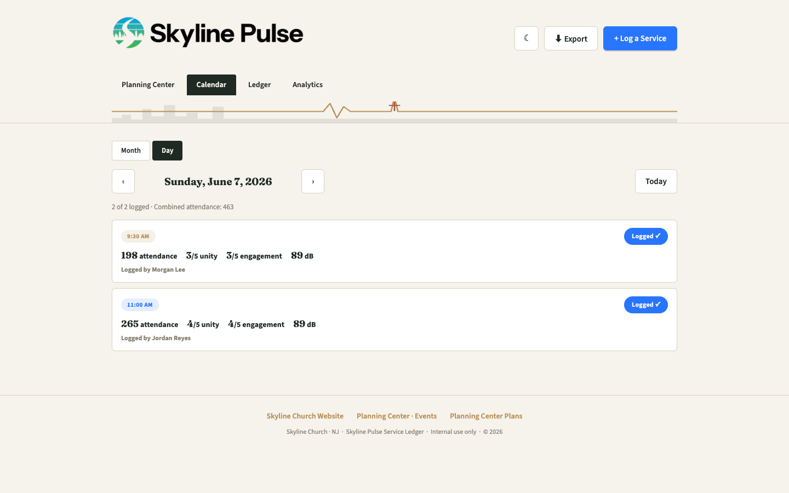
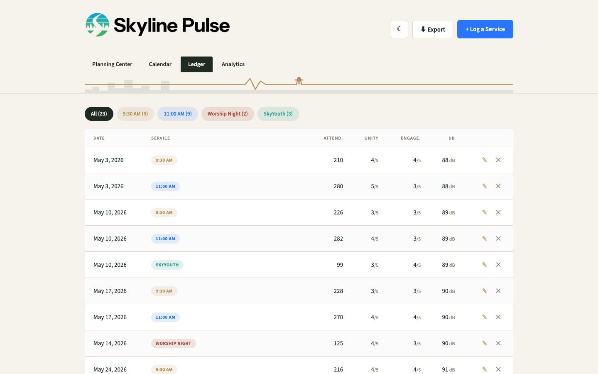
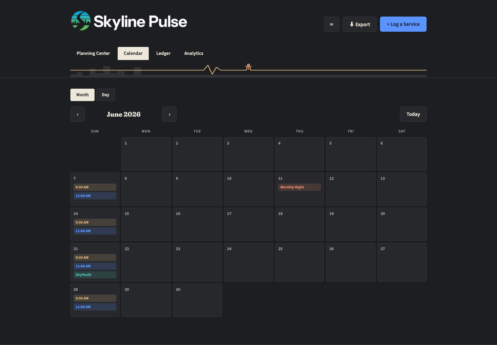
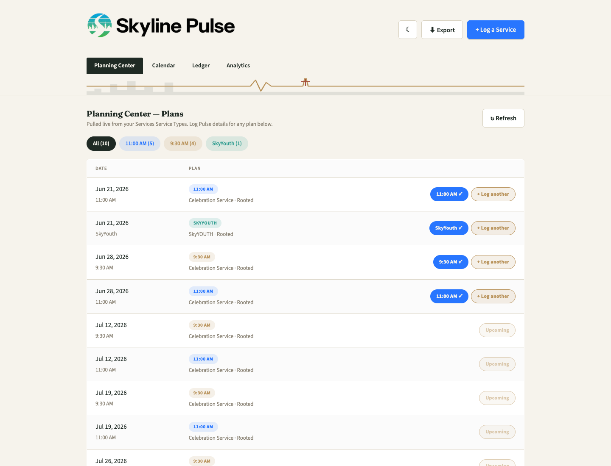
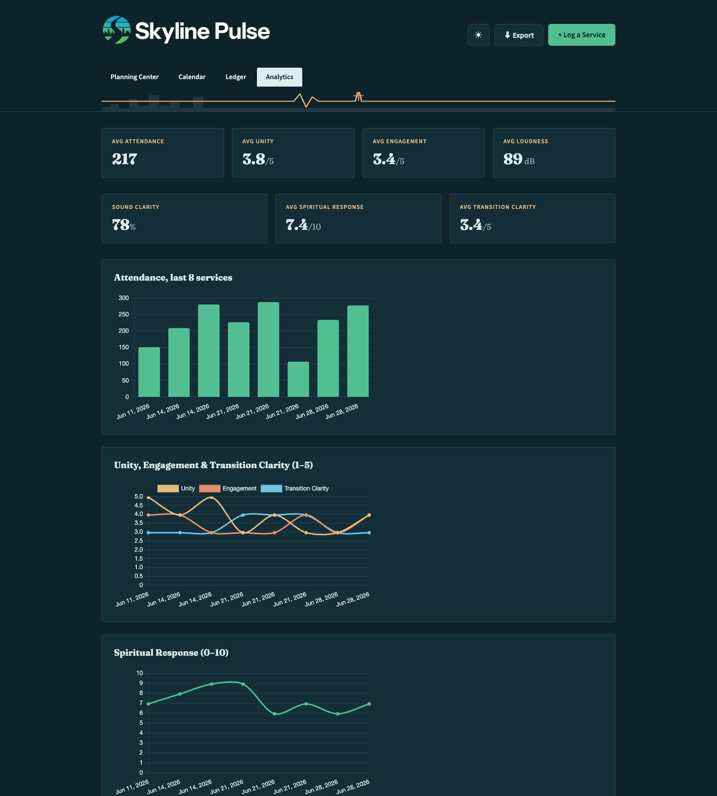

<div align="center">


### Weekly service intelligence for Skyline Church, NJ

Attendance, unity, engagement, room experience, and service flow — logged in under a minute, pulled straight from Planning Center.

[**Open the App ↗**](https://skylinechurchpulse.pages.dev) · [**Project Site**](https://bstef.github.io/skylinechurchpulse/) · [Deployment Guide](#deployment-guide)

<br>



</div>

## What it is

Skyline Pulse is a single-page web app that replaces the texts, spreadsheets, and memory that used to hold a worship team's week-over-week numbers. After each service, someone logs:

- **Attendance, worship unity, and audience engagement**
- **Loudness (dB)**
- **Room experience** — sound clarity in the back of the room, spiritual response 2/3 back, transition clarity
- **Service flow** — whether lighting, talking segments, announcements, and the sermon landed as planned
- **Who logged it** — lightweight attribution, no login required

Every entry is filterable, chartable, and exportable, and Plans pull in automatically from Planning Center so nothing gets typed twice.

There's no build step and no framework — `index.html` is the entire application, talking directly to a Supabase Postgres database.

## Features

| | |
|---|---|
| 🗓️ **Calendar** | Month grid or a focused Day view for Sunday morning, with combined attendance rollups |
| 🔗 **Planning Center sync** | Plans, sermon artwork, and multi-service times (9:30/11:00) pulled live from your Services Service Types |
| 📋 **Ledger** | Every logged service, filterable by type, with inline edit/delete and undo |
| 📈 **Analytics** | Rolling trend charts for every measurement, plus a breakdown of who's been logging |
| 🎨 **Three themes** | Light, Dark, and Ocean — remembered per device |
| ⬇️ **CSV export** | The whole ledger, one click |

<div align="center">
<table>
<tr>
<td></td>
<td></td>
</tr>
<tr>
<td align="center"><sub>Ledger — Light</sub></td>
<td align="center"><sub>Calendar — Dark</sub></td>
</tr>
<tr>
<td></td>
<td></td>
</tr>
<tr>
<td align="center"><sub>Planning Center sync</sub></td>
<td align="center"><sub>Analytics — Ocean</sub></td>
</tr>
</table>
</div>

## Tech stack

- **`index.html`** — the whole app (Supabase JS + Chart.js loaded from CDN, no build step)
- **[Supabase](https://supabase.com)** — Postgres + Row Level Security as the backend, called directly from the browser
- **[Cloudflare Pages](https://pages.cloudflare.com)** — static hosting, auto-deploys on every push to `main`
- **Cloudflare Pages Functions** (`functions/api/pco-plans.js`) — a small serverless proxy that keeps the Planning Center API token off the client
- **[Chart.js](https://www.chartjs.org)** — analytics charts, themed live from the same CSS custom properties as the app

## Repo layout

```
index.html                  the whole app
db/schema.sql                run once (and after pulls) in the Supabase SQL editor
functions/api/pco-plans.js   Cloudflare Pages Function — proxies Planning Center
assets/                      logo and favicon images
docs/                        project site (GitHub Pages) + README screenshots
```

## Project site (GitHub Pages)

`docs/index.html` is a self-contained marketing/info page describing the app — no build step, same fonts and theme system as the app itself. To publish it:

1. Repo → **Settings → Pages**
2. **Source**: Deploy from a branch → **Branch**: `main`, folder **`/docs`**
3. Save. GitHub gives you a URL like `https://bstef.github.io/skylinechurchpulse/`.

Editing it later is just editing `docs/index.html` and pushing — GitHub Pages rebuilds automatically.

---

## Deployment Guide

### 1. Create the Supabase project
1. Go to https://supabase.com → New project (free tier is plenty).
2. Once it's created, go to **SQL Editor** → paste the contents of `db/schema.sql` → Run.
   (`db/schema.sql` is safe to re-run any time — every migration in it only adds a column/constraint/policy if it's missing.)
3. Go to **Project Settings → API**. Copy:
   - **Project URL**
   - **anon public** key

### 2. Connect the app to Supabase
Open `index.html`, find these two lines near the top of the `<script>` block:

```js
const SUPABASE_URL = "YOUR_SUPABASE_PROJECT_URL";
const SUPABASE_ANON_KEY = "YOUR_SUPABASE_ANON_KEY";
```

Replace with the values from step 1. Save the file. (These are safe to expose publicly — access is controlled by the Row Level Security policies in `db/schema.sql`, not by hiding the key.)

### 3. Deploy to Cloudflare Pages (git-connected)

This app ships a serverless function (`functions/api/pco-plans.js`) that holds the Planning Center API secret. Cloudflare's drag-and-drop "Upload assets" option **cannot** deploy that function — only a git-connected project (or the `wrangler` CLI) can. So deploy via git:

1. Push this repo to GitHub (already done if you're reading this from the repo).
2. Cloudflare dashboard → **Workers & Pages** → **Create** → **Pages** → **Connect to Git** → pick this repo.
3. Build settings: no framework, no build command, output directory `/`.
4. Deploy. Cloudflare gives you a URL like `skyline-pulse.pages.dev`, and auto-redeploys on every push to `main`.

If you'd rather deploy from the command line instead of connecting Git, install [`wrangler`](https://developers.cloudflare.com/workers/wrangler/) and run `wrangler pages deploy .` from this folder — that also picks up `functions/`.

### 4. Planning Center integration (optional)

The "Planning Center" tab pulls Plans from your Services Service Types so you can log Pulse details against real events instead of typing them from scratch. It needs a Planning Center **Personal Access Token**, kept server-side.

**Create the token:**

1. Log into Planning Center as someone with full **Services** access (the token can only see what that person can see).
2. Go to `https://api.planningcenteronline.com/personal_access_tokens` → **New Personal Access Token** → name it something like "Skyline Pulse Integration".
3. Copy the **Application ID** and **Secret** right away — the secret is only shown once.

**Set it in production (Cloudflare Pages):**

1. Pages project → **Settings → Variables and Secrets** → **Add**.
2. Add `PCO_APP_ID` and `PCO_SECRET` as type **Secret**, for both Production and Preview environments.
3. Redeploy (or trigger a new deploy) so the function picks them up.

_(Equivalent via CLI: `wrangler pages secret put PCO_APP_ID` / `wrangler pages secret put PCO_SECRET`.)_

**Set it for local testing:**

1. Create a file named `.dev.vars` in the project root (already git-ignored) with:

   ```text
   PCO_APP_ID=your_app_id
   PCO_SECRET=your_secret
   ```

2. Run `wrangler pages dev .` — this serves `index.html` and `functions/` together locally with those secrets loaded.
3. Sanity check the credentials directly first if something looks off: `curl -u APP_ID:SECRET https://api.planningcenteronline.com/services/v2/service_types` should return a `200` with JSON.

If `PCO_APP_ID`/`PCO_SECRET` aren't set, the Planning Center tab just shows a configuration error — the rest of the app (Ledger, Analytics) works fine without it.

Service Type folder names in Planning Center won't necessarily match Pulse's fixed service list (`9:30 AM`, `11:00 AM`, `Worship Night`, `SkyYouth`, `Special Event`). Pulse makes a best-effort guess via `PCO_SERVICE_TYPE_ALIASES` near the top of `index.html`'s script — tune those arrays once you see your real folder names show up as "unmatched."

### 5. (Optional) Custom domain
In the Pages project → **Custom domains** → add something like `pulse.skylinechurchnj.org` if you own that domain and it's on Cloudflare DNS.

### 6. Share it
Send the `.pages.dev` (or custom) URL to the pastor and worship leader. No login required — anyone with the link can add or view entries; a "Logged by" field just tracks who entered a given day's numbers.

## Notes
- To lock the app down later (e.g. require login), you'd add Supabase Auth and change the RLS policies in `db/schema.sql` from `using (true)` to check `auth.uid()`.
- All charts and ledger data logic run client-side against Supabase directly. Only the Planning Center calls go through the Cloudflare Function, since that's the one credential that can't be exposed in the browser.
