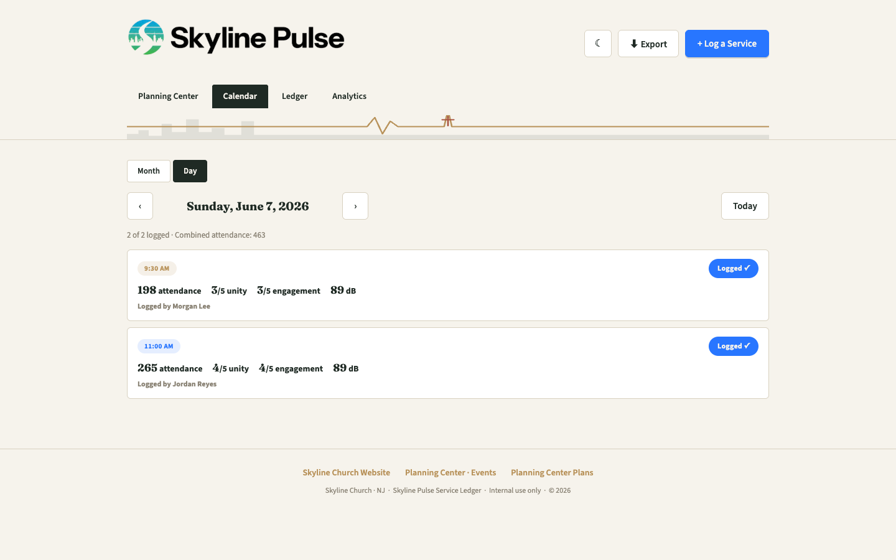
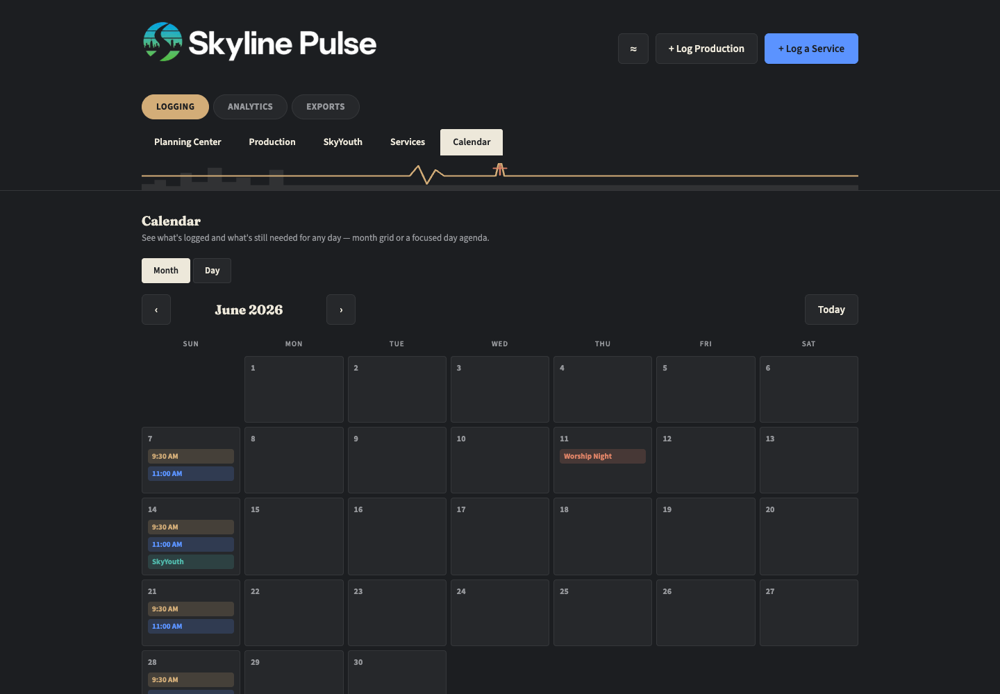
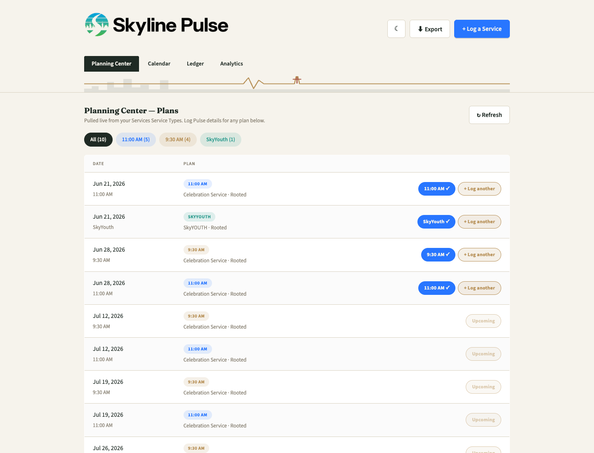
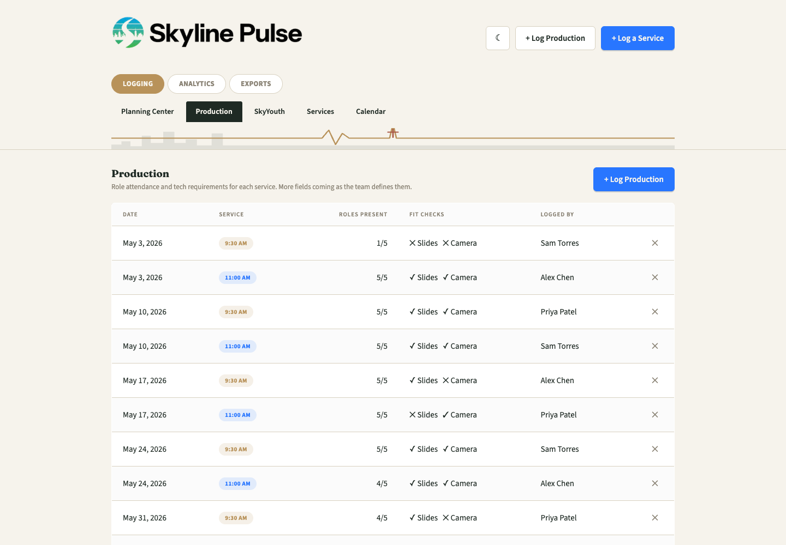
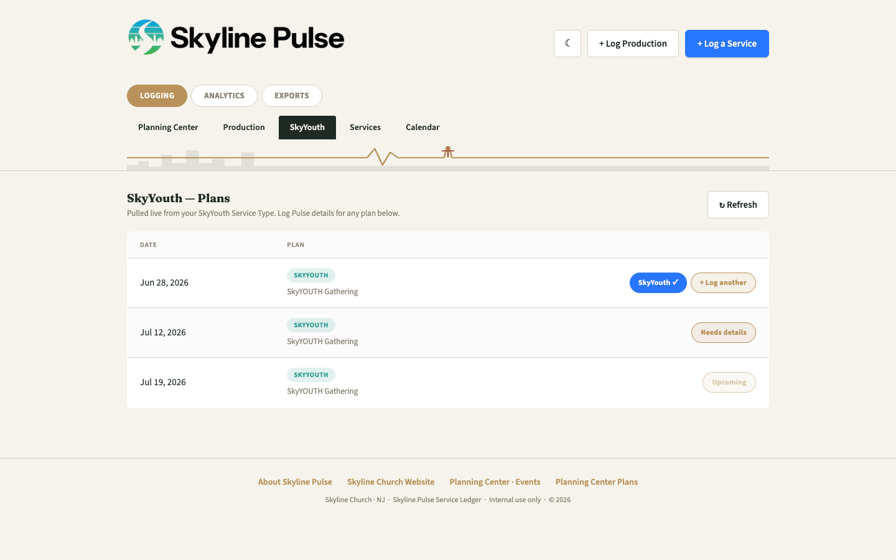
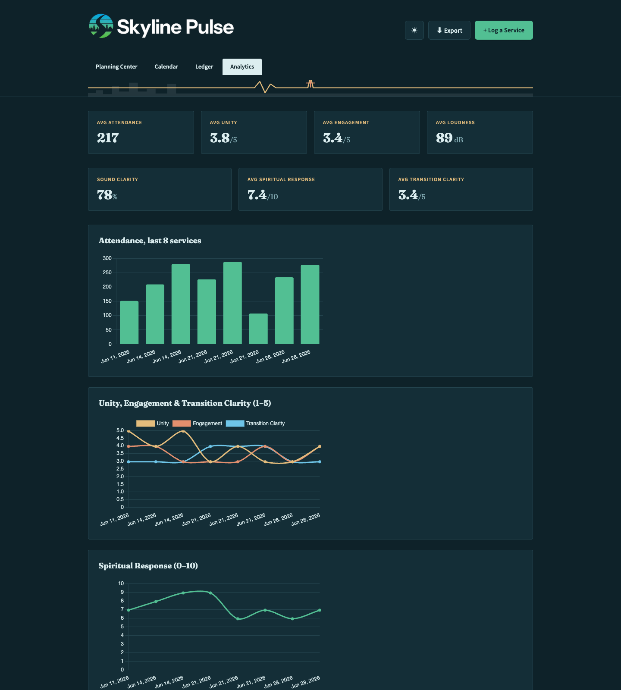
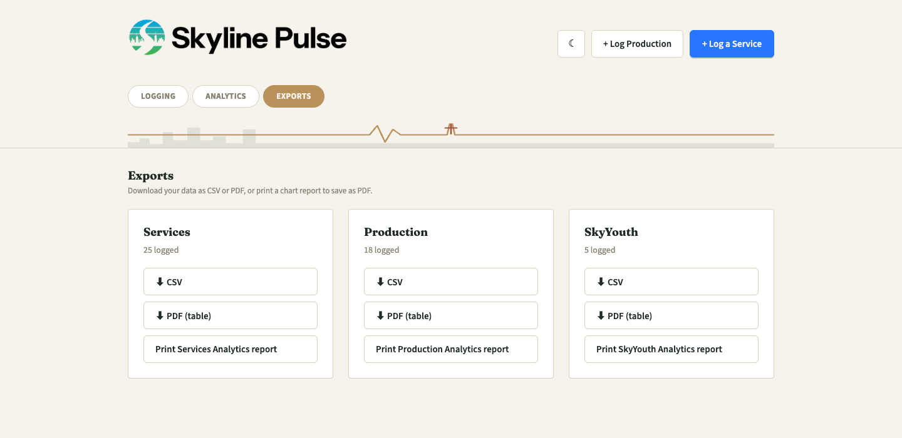

<div align="center">


### Weekly service intelligence for Skyline Church, NJ

Attendance, unity, engagement, room experience, and service flow — logged in under a minute, pulled straight from Planning Center.

[**Open the App ↗**](https://skylinechurchpulse.pages.dev) · [**Project Site**](https://bstef.github.io/skylinechurchpulse/) · [Deployment Guide](#deployment-guide)

<br>



</div>

## What it is

Skyline Pulse is a single-page web app that replaces the texts, spreadsheets, and memory that used to hold a worship team's week-over-week numbers. After each service, someone logs:

- **Attendance, worship unity, and audience engagement**
- **Loudness (dB)**
- **Room experience** — sound clarity in the back of the room, spiritual response 2/3 back, transition clarity
- **Service flow** — whether lighting, talking segments, announcements, and the sermon landed as planned
- **Who logged it** — lightweight attribution, no login required

Every entry is filterable, chartable, and exportable, and Plans pull in automatically from Planning Center so nothing gets typed twice.

There's no build step and no framework — `index.html` is the entire application, talking directly to a Supabase Postgres database.

## Features

| | |
|---|---|
| 🗓️ **Calendar** | Month grid or a focused Day view for Sunday morning — attendance rollups, plus edit/delete on any logged service |
| 🔗 **Planning Center sync** | Plans, sermon artwork, and multi-service times (9:30/11:00) pulled live from your Services Service Types — attendance headcounts pull in too, from Check-Ins, and stay editable/overridable per service |
| 🎛️ **Production tracking** | Role attendance (lights, camera, director, computer/ProPresenter, audio), a 1–4 graded slides fit-check with a miss count, and a Slides Leaderboard ranking who's sharpest on cues |
| 🎧 **SkyYouth** | Its own Planning Center feed, ledger, and analytics — never mixed in with Sunday morning |
| 📈 **Analytics** | Rolling trend charts for Services, Production, and SkyYouth, plus a breakdown of who's been logging |
| 🎨 **Three themes** | Light, Dark, and Ocean — remembered per device |
| ⬇️ **Exports** | CSV, formatted PDF tables, and print-ready analytics reports for every dataset |

<div align="center">
<table>
<tr>
<td></td>
<td></td>
</tr>
<tr>
<td align="center"><sub>Calendar — Dark</sub></td>
<td align="center"><sub>Planning Center sync</sub></td>
</tr>
<tr>
<td></td>
<td></td>
</tr>
<tr>
<td align="center"><sub>Production</sub></td>
<td align="center"><sub>SkyYouth</sub></td>
</tr>
<tr>
<td></td>
<td></td>
</tr>
<tr>
<td align="center"><sub>Analytics — Ocean</sub></td>
<td align="center"><sub>Exports</sub></td>
</tr>
</table>
</div>

## Tech stack

- **`index.html`** — the whole app (Supabase JS + Chart.js loaded from CDN, no build step)
- **[Supabase](https://supabase.com)** — Postgres + Row Level Security as the backend, called directly from the browser
- **[Cloudflare Pages](https://pages.cloudflare.com)** — static hosting, auto-deploys on every push to `main`
- **Cloudflare Pages Functions** (`functions/api/pco-plans.js`) — a small serverless proxy that keeps the Planning Center API token off the client, pulling both Plans (Services) and headcounts (Check-Ins)
- **[Chart.js](https://www.chartjs.org)** — analytics charts, themed live from the same CSS custom properties as the app

## Repo layout

```
index.html                  the whole app
db/schema.sql                run once (and after pulls) in the Supabase SQL editor
functions/api/pco-plans.js   Cloudflare Pages Function — proxies Planning Center
assets/                      logo and favicon images
docs/                        project site (GitHub Pages) + README screenshots
```

## Project site (GitHub Pages)

`docs/index.html` is a self-contained marketing/info page describing the app — no build step, same fonts and theme system as the app itself. To publish it:

1. Repo → **Settings → Pages**
2. **Source**: Deploy from a branch → **Branch**: `main`, folder **`/docs`**
3. Save. GitHub gives you a URL like `https://bstef.github.io/skylinechurchpulse/`.

Editing it later is just editing `docs/index.html` and pushing — GitHub Pages rebuilds automatically.

`docs/guide.html` is the full user guide (linked from the app's `Help` button and from the project site), also downloadable as a PDF (`docs/skyline-pulse-guide.pdf`) via the button on that page. The PDF isn't generated automatically — after editing the guide, regenerate it locally with headless Chromium/Playwright printing the local file to PDF (`page.pdf()` with `@media print` emulated). Since printing a local `file://` page bakes relative links into machine-local file paths, inject a `<base href="https://skylinechurch.tech/docs/guide.html">` into the loaded page (`page.evaluate(...)`, prepended to `<head>`) before calling `page.pdf()` so links in the PDF resolve to real public URLs — then commit the updated PDF alongside the HTML changes.

---

## Deployment Guide

### 1. Create the Supabase project
1. Go to https://supabase.com → New project (free tier is plenty).
2. Once it's created, go to **SQL Editor** → paste the contents of `db/schema.sql` → Run.
   (`db/schema.sql` is safe to re-run any time — every migration in it only adds a column/constraint/policy if it's missing.)
3. Go to **Project Settings → API**. Copy:
   - **Project URL**
   - **anon public** key

### 2. Connect the app to Supabase
Open `index.html`, find these two lines near the top of the `<script>` block:

```js
const SUPABASE_URL = "YOUR_SUPABASE_PROJECT_URL";
const SUPABASE_ANON_KEY = "YOUR_SUPABASE_ANON_KEY";
```

Replace with the values from step 1. Save the file. (These are safe to expose publicly — access is controlled by the Row Level Security policies in `db/schema.sql`, not by hiding the key.)

### 3. Deploy to Cloudflare Pages (git-connected)

This app ships a serverless function (`functions/api/pco-plans.js`) that holds the Planning Center API secret. Cloudflare's drag-and-drop "Upload assets" option **cannot** deploy that function — only a git-connected project (or the `wrangler` CLI) can. So deploy via git:

1. Push this repo to GitHub (already done if you're reading this from the repo).
2. Cloudflare dashboard → **Workers & Pages** → **Create** → **Pages** → **Connect to Git** → pick this repo.
3. Build settings: no framework, no build command, output directory `/`.
4. Deploy. Cloudflare gives you a URL like `skyline-pulse.pages.dev`, and auto-redeploys on every push to `main`.

If you'd rather deploy from the command line instead of connecting Git, install [`wrangler`](https://developers.cloudflare.com/workers/wrangler/) and run `wrangler pages deploy .` from this folder — that also picks up `functions/`.

### 4. Planning Center integration (optional)

The "Planning Center" tab pulls Plans from your Services Service Types so you can log Pulse details against real events instead of typing them from scratch. It needs a Planning Center **Personal Access Token**, kept server-side.

**Create the token:**

1. Log into Planning Center as someone with full **Services** access (the token can only see what that person can see).
2. Go to `https://api.planningcenteronline.com/personal_access_tokens` → **New Personal Access Token** → name it something like "Skyline Pulse Integration".
3. Copy the **Application ID** and **Secret** right away — the secret is only shown once.

**Set it in production (Cloudflare Pages):**

1. Pages project → **Settings → Variables and Secrets** → **Add**.
2. Add `PCO_APP_ID` and `PCO_SECRET` as type **Secret**, for both Production and Preview environments.
3. Redeploy (or trigger a new deploy) so the function picks them up.

_(Equivalent via CLI: `wrangler pages secret put PCO_APP_ID` / `wrangler pages secret put PCO_SECRET`.)_

**Set it for local testing:**

1. Create a file named `.dev.vars` in the project root (already git-ignored) with:

   ```text
   PCO_APP_ID=your_app_id
   PCO_SECRET=your_secret
   ```

2. Run `wrangler pages dev .` — this serves `index.html` and `functions/` together locally with those secrets loaded.
3. Sanity check the credentials directly first if something looks off: `curl -u APP_ID:SECRET https://api.planningcenteronline.com/services/v2/service_types` should return a `200` with JSON.

If `PCO_APP_ID`/`PCO_SECRET` aren't set, the Planning Center tab just shows a configuration error — the rest of the app (Analytics, Calendar) works fine without it.

Service Type folder names in Planning Center won't necessarily match Pulse's fixed service list (`9:30 AM`, `11:00 AM`, `Worship Night`, `SkyYouth`, `Special Event`). Pulse makes a best-effort guess via `PCO_SERVICE_TYPE_ALIASES` near the top of `index.html`'s script — tune those arrays once you see your real folder names show up as "unmatched."

**Attendance auto-fill (optional, no extra setup):** the same token is also used to pull headcounts from Planning Center **Check-Ins**, if your org has it enabled. A Check-Ins "event period" usually spans a whole day and can bundle multiple services (e.g. 9:30 and 11:00) under one combined number, so `functions/api/pco-plans.js` first tries each period's individual **event times** — the actual per-service breakdown Check-Ins tracks internally — and only falls back to the period's combined total when no such breakdown exists. It then matches each candidate to a Plan by same-day date plus best-effort name/time similarity, and reports it as `attendance_from_pco` on the plan. Where Check-Ins reports a `total_count`, that's used over manually summing regular + guest, since it also picks up volunteers and any custom Headcount categories beyond the standard Regular/Guest/Volunteer types. The Log form pre-fills Attendance with that number and tags it **"From PCO"**; editing the number relabels it **"Overridden"** — the original PCO number is still saved (`attendance_pco_value` in `service_entries`) so that badge stays correct on later edits. If Check-Ins isn't enabled, or a plan has no same-day match, this just degrades to a blank/manual Attendance field — nothing breaks.

**Church Stats page (optional, no extra setup):** the **Church Stats** page (`functions/api/pco-stats.js`) pulls org-wide numbers straight from Planning Center — an 8-week Check-Ins attendance trend, People/membership counts (active people, households, new people in the last 30 days), and Serving/volunteer scheduling for the next 3 weeks (volunteers scheduled, a **Responded**/**Needs Confirmation** breakdown, and a "most scheduled" list). Each of the three sections is fetched and reported independently, so if the token only has access to some of these (e.g. Check-Ins but not People), the sections it can't reach just show a small "not available" note instead of breaking the page. This intentionally does **not** touch Planning Center **Giving** — this app has no login, so anything shown here is visible to anyone with the shared link, and financial data doesn't belong in that exposure model without real access control in front of it.

Every signup in a Plan's team lands in exactly one bucket — **confirmed**, **declined**, or **needs response** — so **Responded** (confirmed + declined) and **Needs Response** always add back up to the total signups; declined counts as a response (a no), not as "still needs one." Both the Home page and Church Stats show the math spelled out (e.g. "12 responded + 3 awaiting response = 15 total").

**Planning Center Responses tab (optional, no extra setup):** the **Serving** tab (under Logging) drills into the same Serving data one level deeper than Church Stats' summary — one card per Plan, showing exactly who's **Needs Response**, **Declined**, or **Confirmed** for that plan's team, so you don't have to dig through Planning Center's own matrix view to find who hasn't answered yet. It shares `churchStats.serving` with the Church Stats page (`serving.plans`, the next 3 weeks), so that part is fetched once and both views stay in sync — this tab additionally shows history via `serving.past_plans` and its own `↓ Load older services` button (same pattern as the Sunday Services/SkyYouth Plans lists), which never affects the Responded/Needs Response counts since those are about upcoming scheduling gaps specifically. A row of filter chips at the top (same pattern as the Plans lists) lets you narrow down to one Planning Center service type; cards are grouped into one section per type actually present (not a fixed "Sunday Services" heading, since plenty of PCO Service Types — children's check-in, assimilation, etc. — aren't Sunday-only), with no filter selected (**All**) showing one section per type. Note this filters/groups by whole Plan, not individual service time: a multi-time folder like `Celebration Service` (9:30/11:00 as one Plan with two Plan Times) shows as a single group, since Planning Center tracks serving teams at the Plan level — unlike attendance, there's no separate per-time breakdown to group by there. Folders with one service per Plan (like `SkyYouth`) group cleanly.

### 5. Email integration (Resend, optional)

The **Exports** page can email a report on demand, and a separate scheduled job sends an automatic weekly digest (Monday 8am Eastern) summarizing what got logged that week. Both go out from `pulse@skylinechurch.tech` via [Resend](https://resend.com) to whichever addresses are added under **Exports → Email Recipients** (stored in the `email_recipients` table from `db/schema.sql` — no fixed/hardcoded list).

Every send — and every failed send, with its error — is logged to the `email_log` table and shown under **Exports → Recent Emails**, so it's visible that something actually went out. Rows are tiny — nowhere near a real storage concern even after years of weekly sends — but `cron-worker/src/index.js` prunes anything older than 90 days after each digest run anyway, so the table stays small regardless.

**Set up Resend:**

1. In your Resend account, verify the sending domain (`skylinechurch.tech`) under **Domains**, if it isn't already — the from-address above needs that domain verified before Resend will deliver from it.
2. **API Keys** → create a key with **Sending access**. You'll use this same key in both places below.

**On-demand "Email report" (Cloudflare Pages secrets):**

1. Pages project → **Settings → Variables and Secrets** → **Add**.
2. Add these as type **Secret**, for both Production and Preview environments:
   - `RESEND_API_KEY` — the key from above.
   - `SUPABASE_URL` and `SUPABASE_ANON_KEY` — the **same values** from step 1/2 of the Supabase setup above. `send-report-email.js` reads Supabase directly (to look up recipients) rather than through the browser, so it needs its own copy of the same credentials `index.html` uses — set as a secret here instead of hardcoded, so secret scanners don't flag a duplicated key and there's one place to rotate it.
3. Redeploy so `functions/api/send-report-email.js` picks them up.

**Recommended hardening:** `send-report-email.js` has no login to check credentials against (matching this app's no-auth model) — it only rejects requests whose `Origin` isn't this site, which stops casual scanners but not a deliberate direct request. Since a call to it costs a real Resend send and could affect the verified domain's reputation if abused, consider adding a [Cloudflare Rate Limiting Rule](https://developers.cloudflare.com/waf/rate-limiting-rules/) (available on the free plan) for `/api/send-report-email` — e.g. a handful of requests per IP per hour is more than any real usage of the button needs.

**Automatic weekly digest (standalone Cloudflare Worker):**

This is deployed separately from the Pages project, as its own Cloudflare Worker with a native Cron Trigger, from the `cron-worker/` directory. That's deliberate, not incidental: if this site sits behind a Cloudflare Access policy (Zero Trust) covering the whole domain, an external HTTP call — including a scheduled call from GitHub Actions or any other outside service — hits Access's login page and can never get through non-interactively. A Worker's own Cron Trigger runs *inside* Cloudflare's infrastructure on a schedule; it's not an inbound request to the protected zone at all, so it works regardless of what Access policy is (or isn't) protecting the site, and nothing about that policy needs to change.

1. Install [`wrangler`](https://developers.cloudflare.com/workers/wrangler/) if you don't have it, and run `wrangler login` once.
2. From the `cron-worker/` directory, set its secrets (this Worker has its own secret store, separate from the Pages project — same values as above, plus a new one for manual testing):
   ```
   wrangler secret put RESEND_API_KEY
   wrangler secret put SUPABASE_URL
   wrangler secret put SUPABASE_ANON_KEY
   wrangler secret put DIGEST_TEST_SECRET
   ```
   (`DIGEST_TEST_SECRET` is any random string you generate — it only guards the Worker's own manual-test URL, described below.)
3. `wrangler deploy` from `cron-worker/`. This also registers the Cron Trigger declared in `cron-worker/wrangler.toml` (two schedules covering Eastern's DST offsets — the handler itself checks the actual Eastern hour before sending, so only one results in an email).

Note the digest sent this way summarizes Services/Production/SkyYouth logged that week, but doesn't include the Planning Center "needs response" section the in-app pages show — reaching that would mean either duplicating the Planning Center API calls a third time or calling back through the (potentially Access-protected) `/api/pco-stats`, so the email links into the app for that instead.

**Testing it without waiting for Monday:** the Worker also gets its own `*.workers.dev` URL (shown after `wrangler deploy`), which is a different domain than `skylinechurch.tech`/`.pages.dev` and so isn't covered by an Access policy scoped to those. Test with:
```
curl -X POST "https://skyline-pulse-weekly-digest.<your-subdomain>.workers.dev" \
  -H "X-Digest-Secret: <your DIGEST_TEST_SECRET value>"
```

### 6. (Optional) Custom domain
In the Pages project → **Custom domains** → add something like `pulse.skylinechurchnj.org` if you own that domain and it's on Cloudflare DNS.

### 7. Share it
Send the `.pages.dev` (or custom) URL to the pastor and worship leader. No login required — anyone with the link can add or view entries; a "Logged by" field just tracks who entered a given day's numbers.

## Notes
- To lock the app down later (e.g. require login), you'd add Supabase Auth and change the RLS policies in `db/schema.sql` from `using (true)` to check `auth.uid()`.
- All charts and ledger data logic run client-side against Supabase directly. Only the Planning Center calls go through the Cloudflare Function, since that's the one credential that can't be exposed in the browser.
- The standalone "Services" nav tab is hidden by default now that Planning Center is the primary way to log a service — the header's "+ Log a Service" button still opens the identical form as a manual fallback (e.g. a one-off event with no matching Plan), and every logged service stays editable/deletable from the Calendar tab. Nothing was removed; the tab just isn't a nav destination — see the `#tab-log` comment in `index.html` to bring it back.
